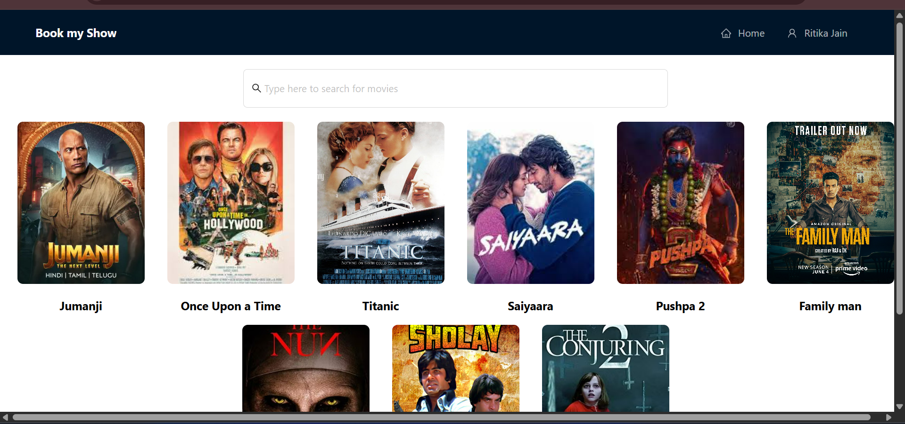
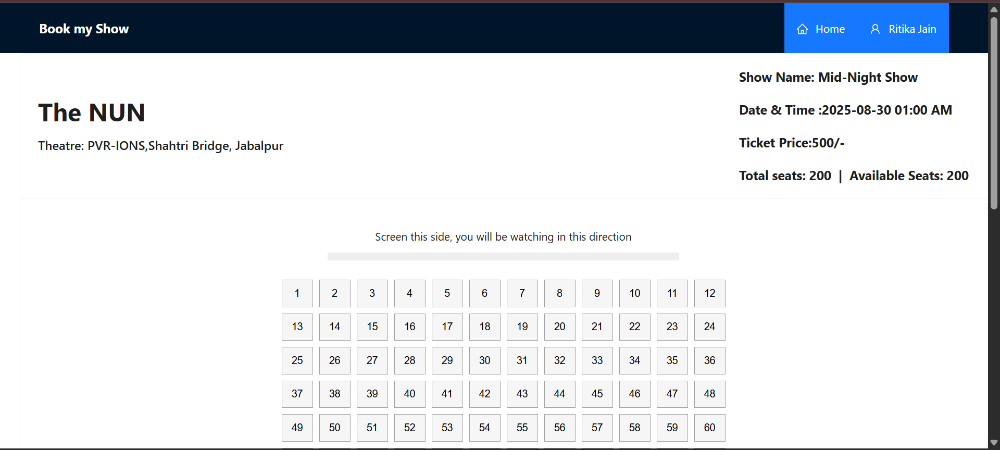
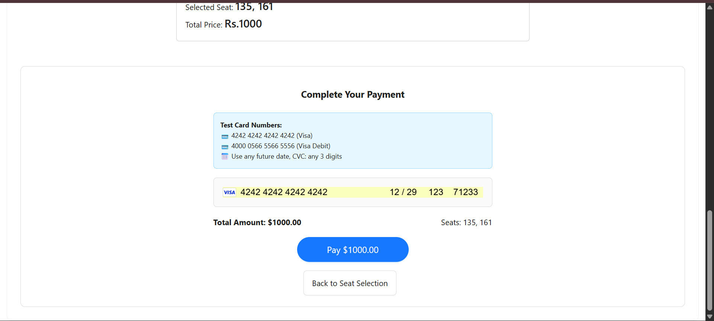
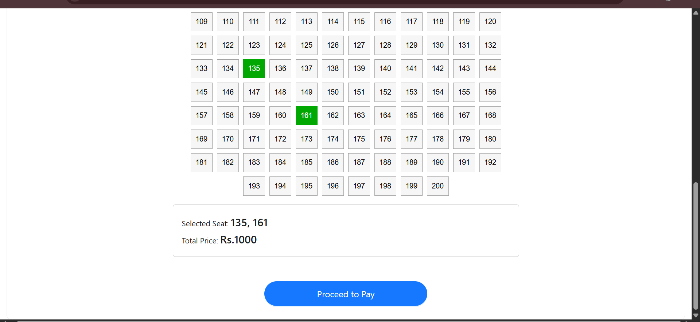
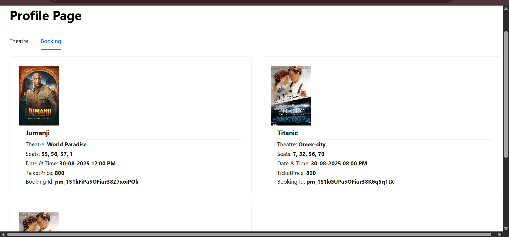

# 🎬 Booking.com - Movie Ticket Booking App

**Live Demo Link**-> https://booking-prod.onrender.com/ 

A full-stack web application where users can **browse movies, book tickets, and make secure payments**.  
Built with **React, Redux, Node.js, Express, Stripe API**, and deployed on **Render**.

---

## ✨ Features
- 🔐 **User Authentication** (Signup/Login)
- 🎞️ **Browse Movies** with details and show timings
- 🏟️ **Select Theatre & Seats**
- 💳 **Stripe Payment Integration** for secure online transactions
- 📜 **Booking History** for users
- ⚡ **Redux** for state management
- 🚀 **Deployment on Render**

---

## 🛠️ Tech Stack
**Frontend:**
- React
- Redux
- JavaScript
- Vite
- Tailwind CSS
- html
- antd design

**Backend:**
- Node.js
- Express.js

**Payment:**
- Stripe API

**Database:**
- MongoDB

**Deployment:**
- Render

---

## 📂 Project Structure
Booking.com/
├── Client/ # Frontend (React + Redux)
├── Server/ # Backend (Node.js + Express)
├── package.json
└── README.md

---

## ⚙️ Installation & Setup

1. **Clone the repo**
   ```bash
   git clone https://github.com/YOUR-USERNAME/Booking.com.git
   cd Booking.com
2. **Install dependencies**

For backend:

cd Server
npm install


For frontend:

cd ../Client
npm install


3.**Set environment variables**
Create a .env file in the Server/ folder:

STRIPE_SECRET_KEY=your_stripe_secret_key
MONGO_URI=your_database_url
JWT_SECRET=your_jwt_secret

4. Run the app locally

Backend:

cd Server
npm start


Frontend:

cd Client
npm run dev


📸 Screenshots:-

### Home Page


### Registration Page


### Booking Page


### Payment Page


### Seat-selection Page


### ticket Page



